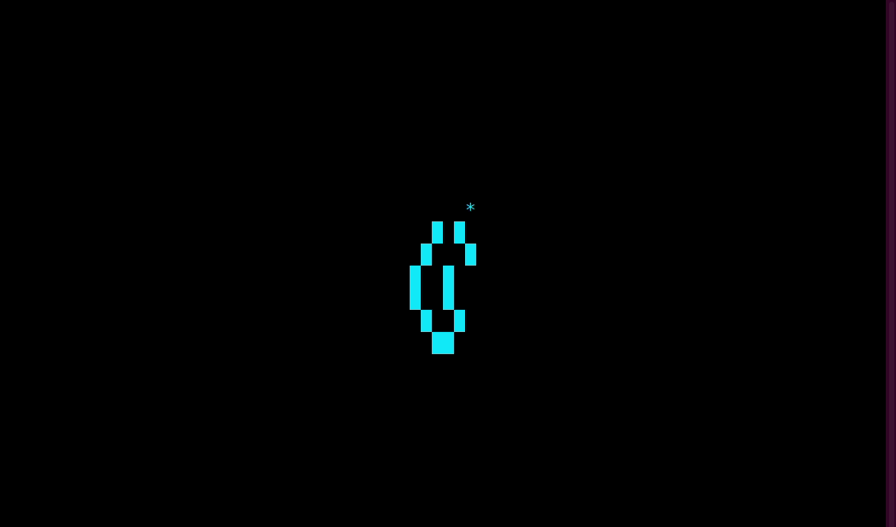
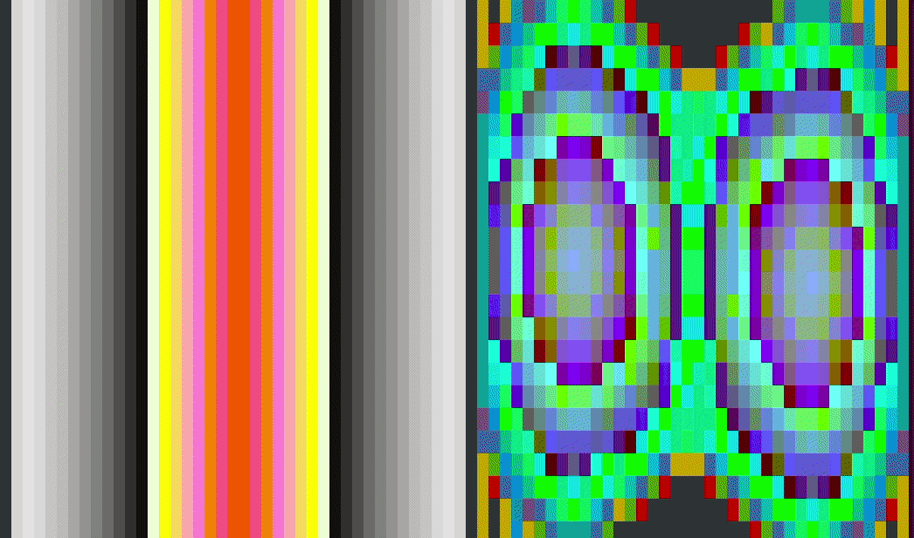
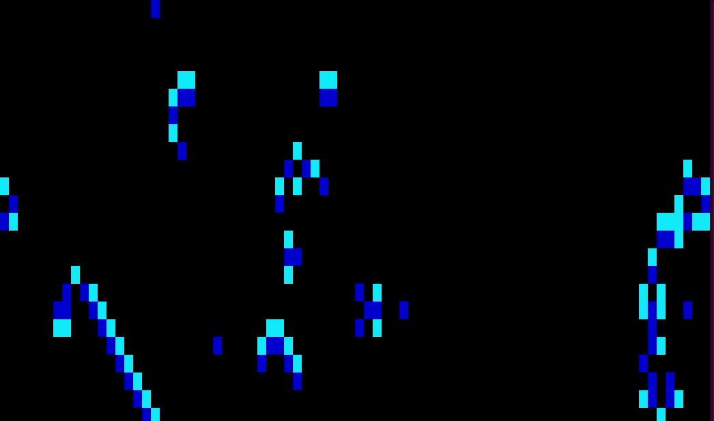
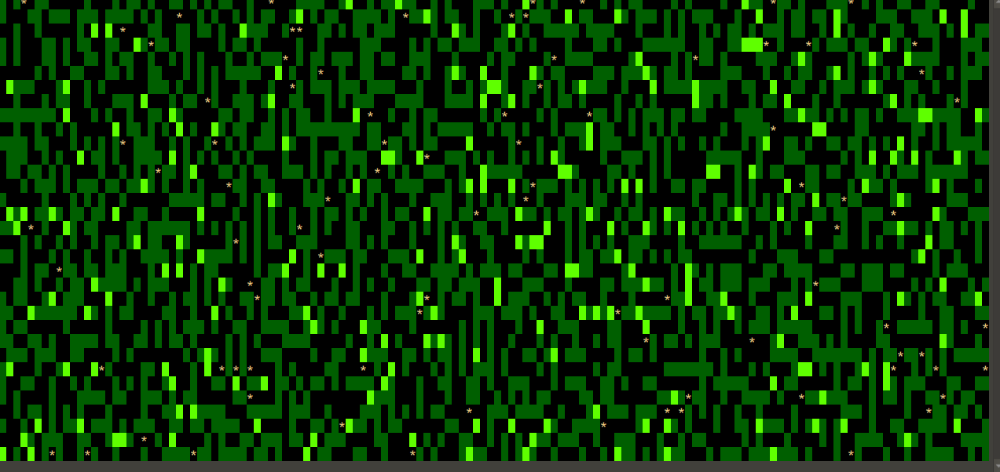
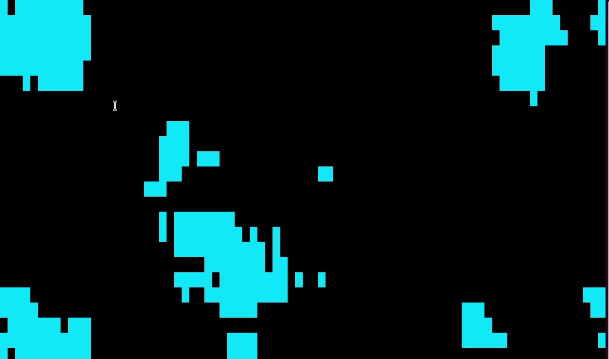
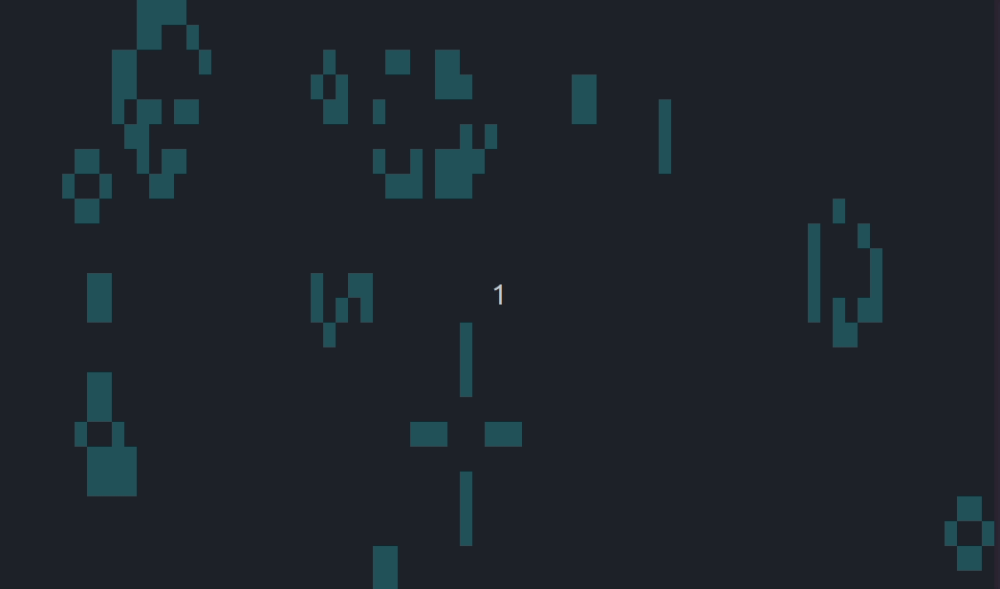
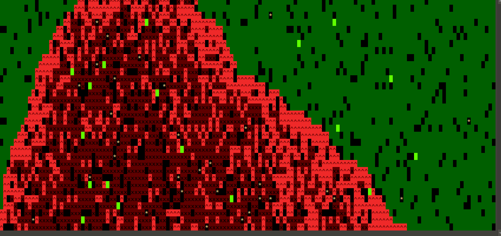
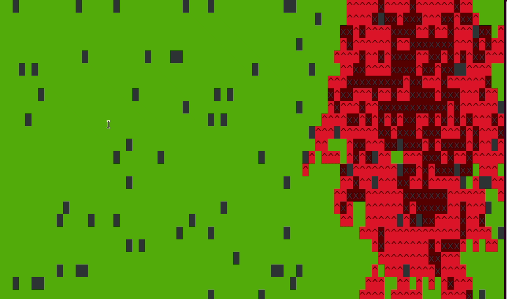

# tautomata
Terminal Cellular Automata

Just some fun little scripts with the following goals:

 - Implement cellular automata in a terminal
 - Require nothing that isn't usually installed by default

## Keys

Key(s) | Action
------ | ----------
Up/Down arrow | Change delay (speed up or slow down)
q | quit
Any other key | Reinitialize the board (usually randomly)

## Scripts

### automata.py
Library that implements the automataBoard and automata classes.  The goal is to make it where all you have to do is define your cell states and create an iterate function that accepts the board in one state and returns the board in the next generation state.

---

### colortest.py
Just a script to spit out the terminal colors with numbers.  So you can choose colors in the configs of each script.

---

### ant.py

[Langton's ant](https://en.wikipedia.org/wiki/Langton's_ant)  

---

### belousov.py

[Belousov-Zhabotinsky Reaction](https://softologyblog.wordpress.com/2017/02/04/the-belousov-zhabotinsky-reaction-and-the-hodgepodge-machine/)  

---

### brain.py

[Brian's Brain](https://en.wikipedia.org/wiki/Brian's_Brain)  

---

### faders.py

[Faders](https://www.fourmilab.ch/cellab/manual/rules.html#Faders)  
Described as a cross between Life and Brain  

---

### forest.py

[A Mathematical Approach to Forest Growth Dynamics](http://web.math.unifi.it/users/primicer/2016%20forest%20growth)  

---

### larger-than-life.py

[Larger than Life](https://www.emis.de/journals/DMTCS/pdfpapers/dmAA0113.pdf)  
Similar to the game of life except configurable neighborhood size, birth range, and survival range.  

---

### life.py

[Conway's Game of Life](https://en.wikipedia.org/wiki/Conway%27s_Game_of_Life)  
The most famous cellular automata.  

---

### reforestation.py

forest.py with the addition of fire

---

### rug.py

[RUG](https://www.fourmilab.ch/cellab/manual/rules.html#Rug)  

  

---

### wildfire.py

[Stochastic Wildland Fire Spread Dynamics](https://iopscience.iop.org/article/10.1088/1742-6596/285/1/012038/pdf)  

  
